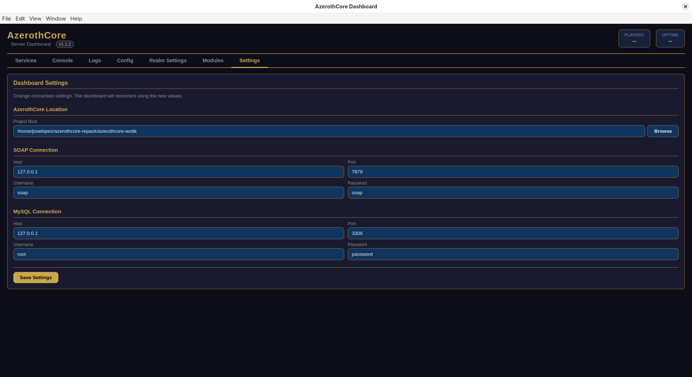
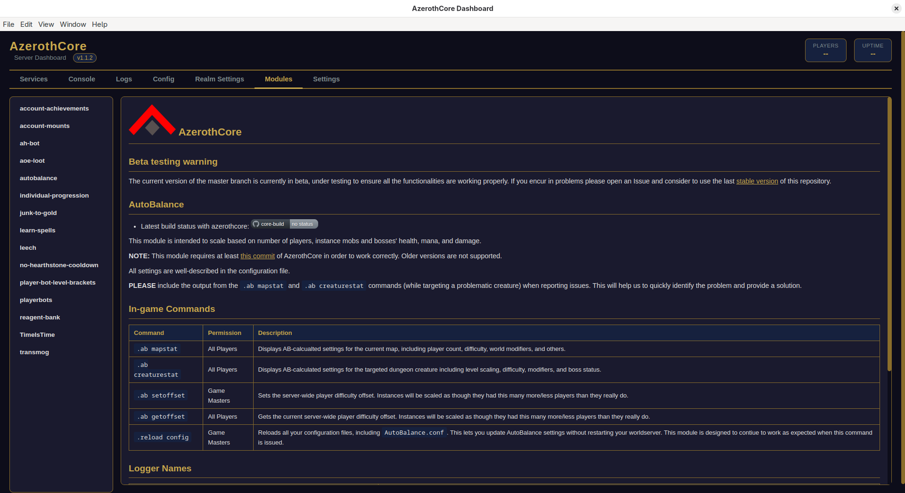
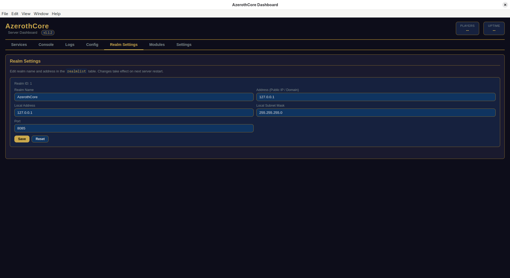
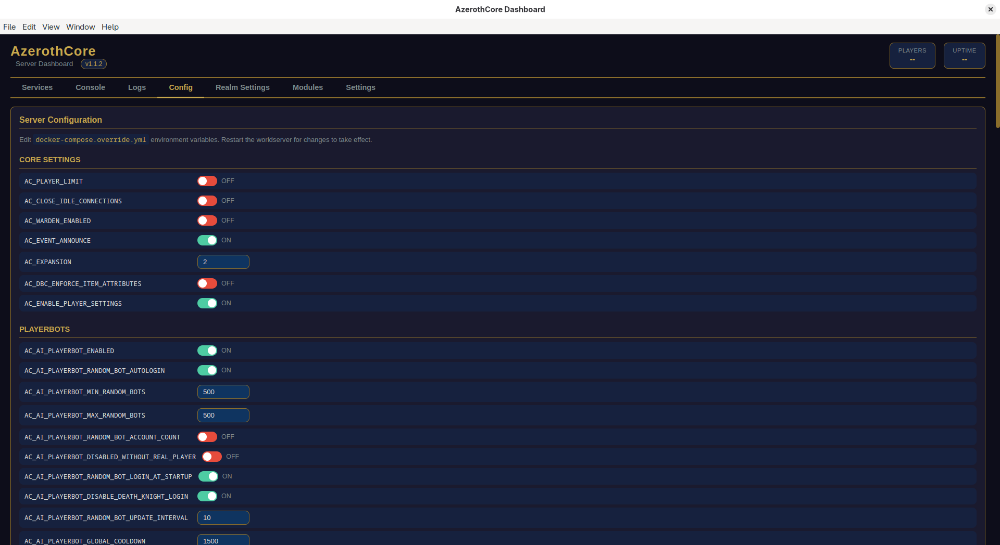
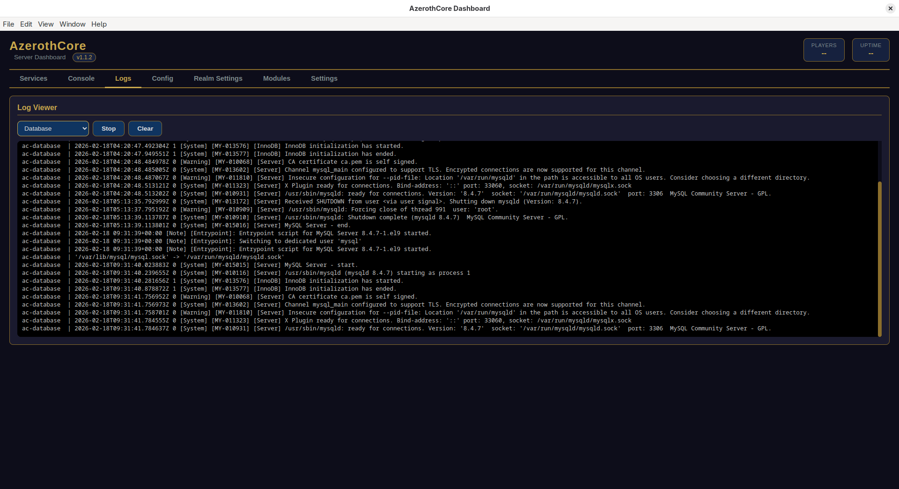
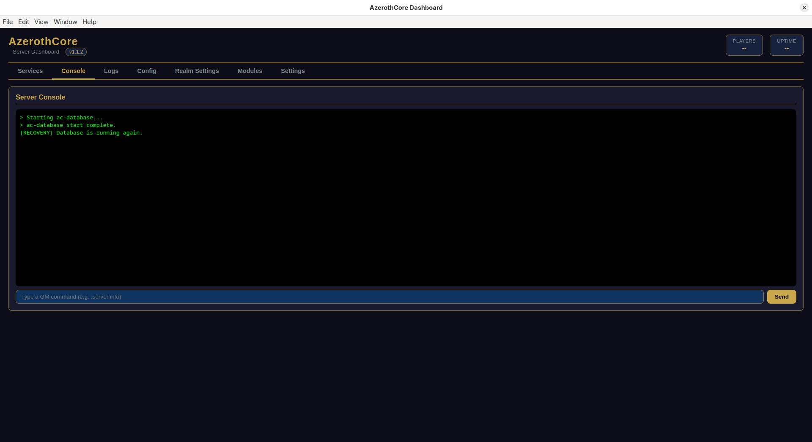
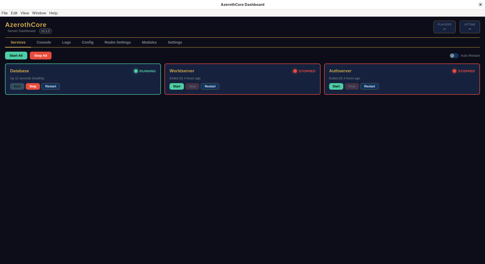

# AzerothCore Dashboard

> **Aviso:** Este proyecto ha sido *vibe coded* basado en mis necesidades personales. Lo hago público por si alguien más lo encuentra útil o quiere usarlo. Este dashboard está pensado para servidores personales o para jugar con amigos, no como una herramienta profesional de administración de servidores privados.

Un dashboard de bandeja del sistema para administrar tu servidor AzerothCore. Construido con Electron, proporciona una interfaz gráfica conveniente para monitorear y controlar tus servicios Docker de AzerothCore sin tocar la terminal.



## Características

- **Gestión de Servicios** - Inicia, detiene y reinicia los servicios de Base de Datos, Worldserver y Authserver
- **Consola en Tiempo Real** - Ejecuta comandos de GM directamente desde el dashboard
- **Logs en Vivo** - Visualiza los logs de cualquier servicio (Base de Datos, Worldserver, Authserver)
- **Editor de Configuración** - Edita las variables de entorno de `docker-compose.override.yml` a través de la interfaz
- **Configuración de Realm** - Modifica el nombre y dirección del realm en la base de datos
- **Visor de Módulos** - Consulta los módulos instalados y su documentación
- **Integración con la Bandeja del Sistema** - Mantén el dashboard ejecutándose en segundo plano
- **Auto-Actualización** - Notificaciones de actualización integradas e instalación con un clic
- **Monitoreo de Jugadores y Tiempo Activo** - Visualiza los jugadores conectados y el tiempo de actividad del servidor de un vistazo

## Capturas de Pantalla


*Administra todos tus servicios de AzerothCore desde un solo lugar*


*Ejecuta comandos de GM directamente*


*Visualiza los logs en tiempo real de cualquier servicio*


*Edita la configuración del servidor a través de la interfaz*


*Administra la configuración de tu realm*


*Configura tus parámetros de conexión*

## Requisitos

- Node.js 18+
- Servidor AzerothCore ejecutándose con Docker
- SOAP habilitado en tu worldserver
- Acceso a la base de datos MySQL

## Instalación

### Desde Lanzamiento

1. Descarga la última versión para tu plataforma desde la página de [Lanzamientos](https://github.com/Jslquintero/azerothcore-dashboard/releases)
2. Ejecuta el instalador
3. Sigue el asistente de configuración para conectar tu servidor

### Desde el Código Fuente

```bash
# Clona el repositorio
git clone https://github.com/Jslquintero/azerothcore-dashboard.git
cd azerothcore-dashboard

# Instala las dependencias
npm install

# Ejecuta el dashboard
npm start
```

## Configuración

Al iniciarse por primera vez, se te pedirá que configures:

1. **Raíz del Proyecto AzerothCore** - Ruta a tu instalación de AzerothCore
2. **Conexión SOAP** - Host, puerto, nombre de usuario y contraseña para SOAP
3. **Conexión MySQL** - Host, puerto, nombre de usuario y contraseña para la base de datos

## Compilación

```bash
# Linux
npm run dist

# Windows
npm run dist:win

# macOS
npm run dist:mac

# Todas las plataformas
npm run dist:all
```

## Uso

Una vez configurado, el dashboard se ejecuta en la bandeja del sistema. Haz clic en el icono de la bandeja para:

- Abrir la ventana del dashboard
- Iniciar/Detener todos los servicios de una vez
- Salir de la aplicación

## Licencia

MIT

## Créditos

Este dashboard fue creado para administrar servidores personales de AzerothCore. AzerothCore es un emulador de código abierto de World of Warcraft.
