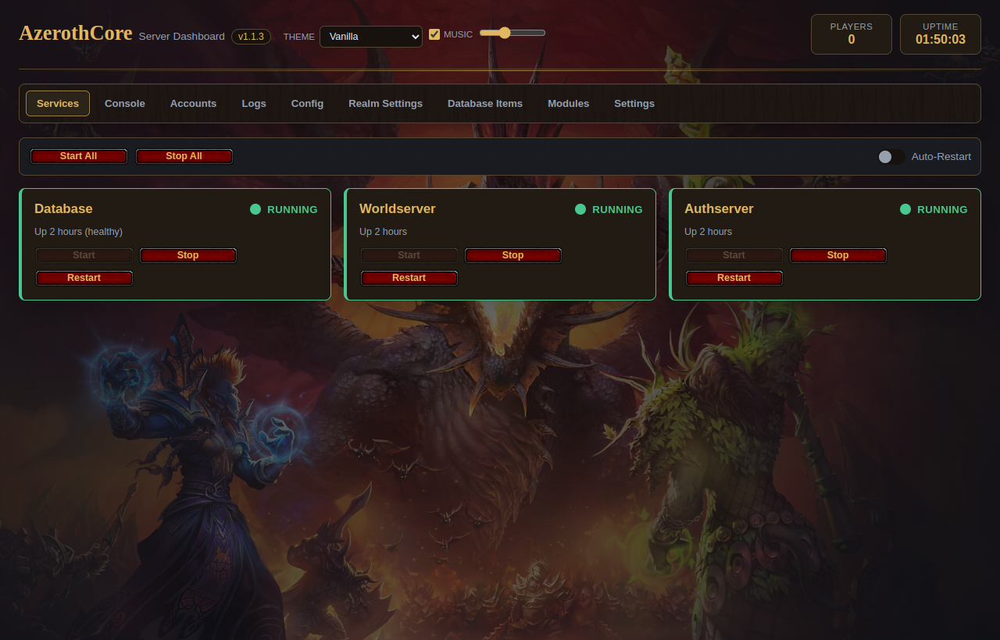
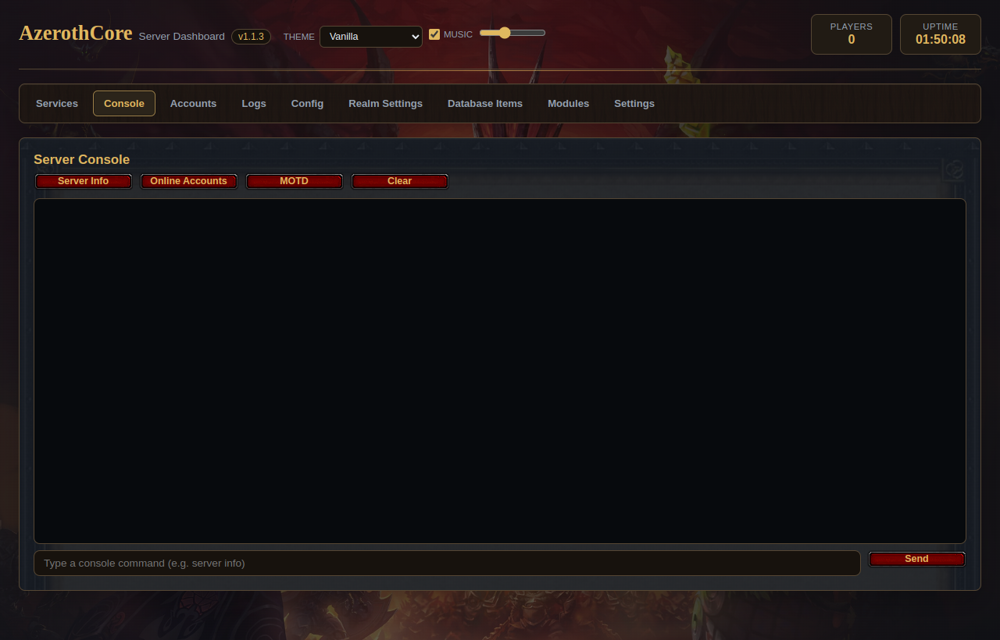
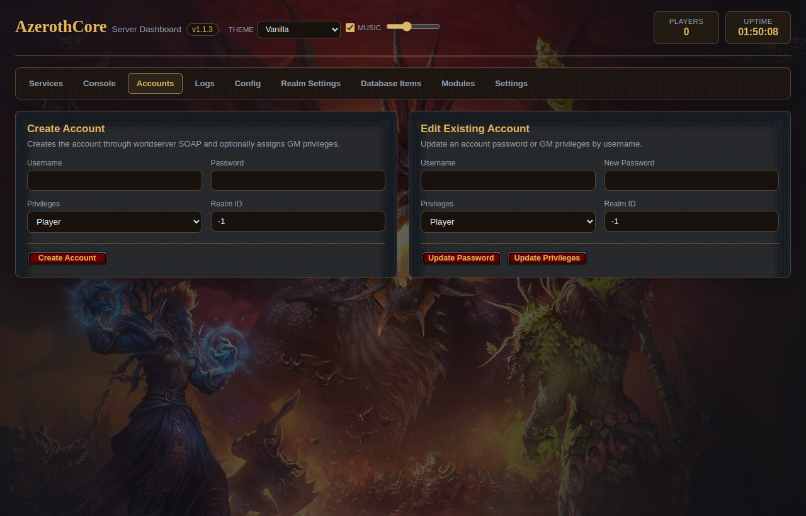
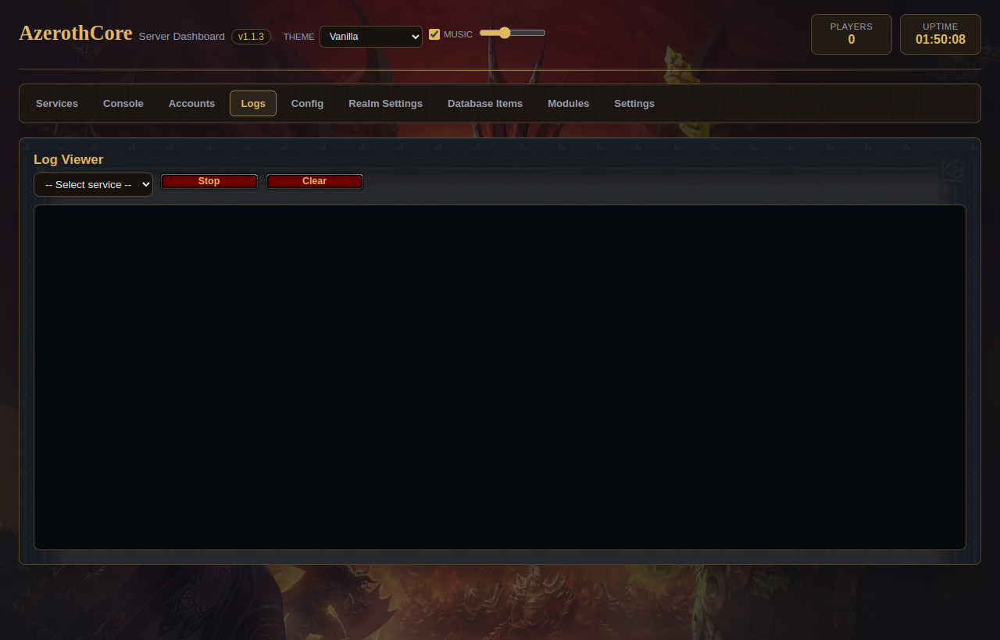
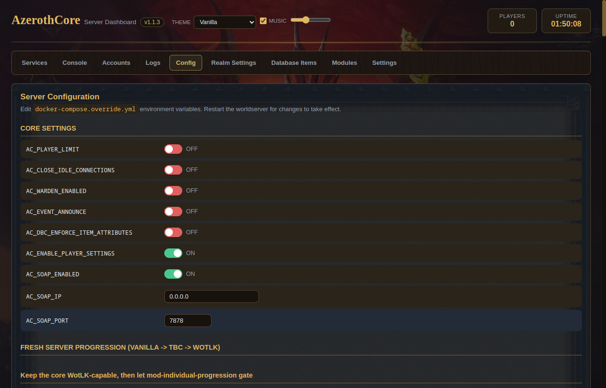
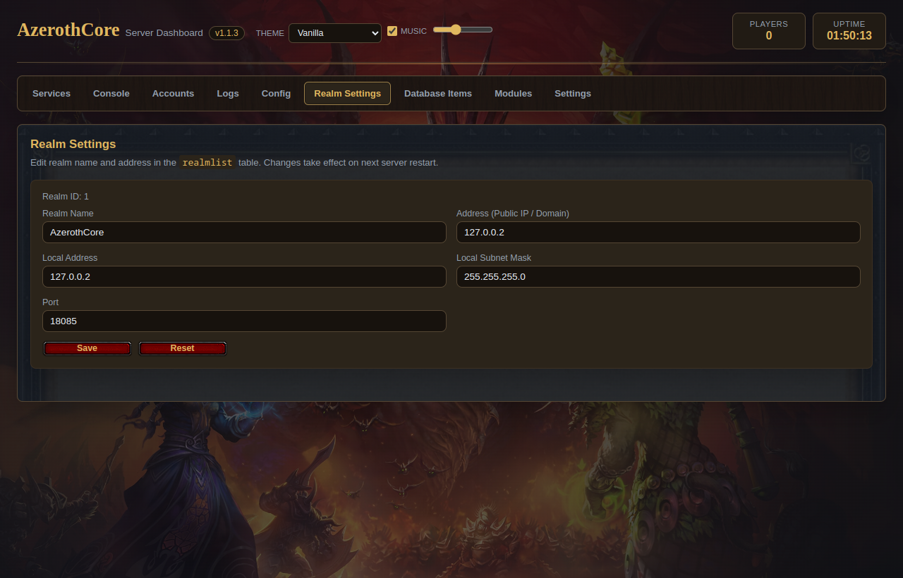
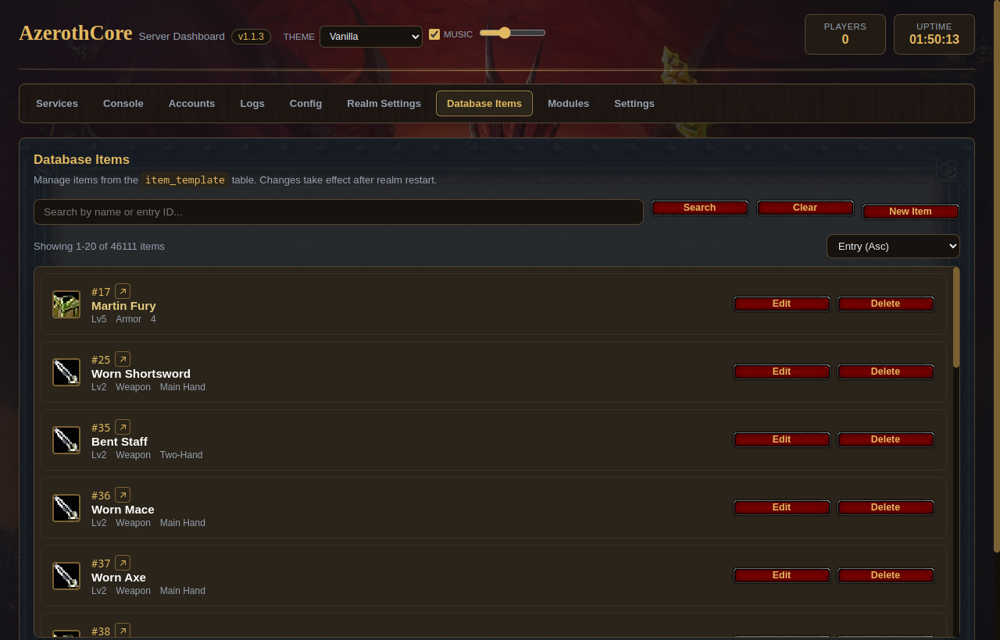
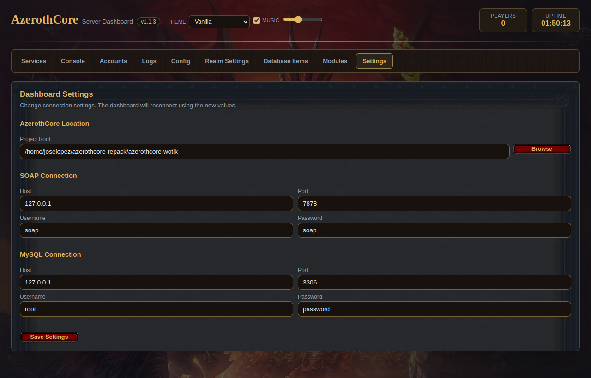

# AzerothCore Dashboard

> **Aviso:** Este proyecto ha sido *vibe coded* basado en mis necesidades personales. Lo hago público por si alguien más lo encuentra útil o quiere usarlo. Este dashboard está pensado para servidores personales o para jugar con amigos, no como una herramienta profesional de administración de servidores privados.

Un dashboard de bandeja del sistema para administrar tu servidor AzerothCore. Construido con Electron, proporciona una interfaz retro inspirada en World of Warcraft para monitorear servicios, ejecutar comandos, administrar cuentas, editar registros de base de datos y evitar tareas repetitivas desde la terminal.



## Características

- **Gestión de Servicios** - Inicia, detiene y reinicia los servicios de Base de Datos, Worldserver y Authserver
- **Consola en Tiempo Real** - Ejecuta comandos de GM directamente desde el dashboard, con comandos rápidos y limpieza de salida
- **Gestión de Cuentas** - Crea cuentas, cambia contraseñas y asigna privilegios GM desde la interfaz
- **Logs en Vivo** - Visualiza los logs de cualquier servicio (Base de Datos, Worldserver, Authserver)
- **Editor de Configuración** - Edita las variables de entorno de `docker-compose.override.yml` a través de la interfaz
- **Configuración de Realm** - Modifica el nombre y dirección del realm en la base de datos
- **Base de Items** - Busca y edita registros de `item_template`, incluyendo enlaces directos a Wowhead
- **Visor de Módulos** - Consulta los módulos instalados y su documentación
- **Temas por Expansión** - Cambia entre arte de Vanilla, Burning Crusade y Wrath of the Lich King
- **Música Opcional por Tema** - Reproduce música local de expansión con control de volumen integrado
- **Integración con la Bandeja del Sistema** - Mantén el dashboard ejecutándose en segundo plano
- **Auto-Actualización** - Notificaciones de actualización integradas e instalación con un clic
- **Monitoreo de Jugadores y Tiempo Activo** - Visualiza los jugadores conectados y el uptime compacto en formato `HH:MM:SS`

## Capturas de Pantalla


*Administra todos tus servicios de AzerothCore desde un solo lugar*


*Ejecuta comandos del servidor con accesos rápidos y salida limpia*


*Crea cuentas y actualiza contraseñas o privilegios GM de cuentas existentes*


*Visualiza los logs en tiempo real de cualquier servicio*


*Edita la configuración del servidor a través de la interfaz*


*Administra la configuración de tu realm*


*Busca plantillas de items y abre sus páginas correspondientes en Wowhead*


*Configura tus parámetros de conexión*

## Requisitos

- Node.js 18+
- Servidor AzerothCore ejecutándose con Docker
- SOAP habilitado en tu worldserver
- Acceso a la base de datos MySQL

## Instalación

### Desde Lanzamiento

1. Descarga la última versión para tu plataforma desde la página de [Lanzamientos](https://github.com/Jslquintero/azerothcore-dashboard/releases)
2. Ejecuta el instalador
3. Sigue el asistente de configuración para conectar tu servidor

### Desde el Código Fuente

```bash
# Clona el repositorio
git clone https://github.com/Jslquintero/azerothcore-dashboard.git
cd azerothcore-dashboard

# Instala las dependencias
npm install

# Ejecuta el dashboard
npm start
```

## Configuración

Al iniciarse por primera vez, se te pedirá que configures:

1. **Raíz del Proyecto AzerothCore** - Ruta a tu instalación de AzerothCore
2. **Conexión SOAP** - Host, puerto, nombre de usuario y contraseña para SOAP
3. **Conexión MySQL** - Host, puerto, nombre de usuario y contraseña para la base de datos

## Compilación

```bash
# Linux
npm run dist

# Windows
npm run dist:win

# macOS
npm run dist:mac

# Todas las plataformas
npm run dist:all
```

## Uso

Una vez configurado, el dashboard se ejecuta en la bandeja del sistema. Haz clic en el icono de la bandeja para:

- Abrir la ventana del dashboard
- Iniciar/Detener todos los servicios de una vez
- Salir de la aplicación

## Licencia

MIT

## Créditos

Este dashboard fue creado para administrar servidores personales de AzerothCore. AzerothCore es un emulador de código abierto de World of Warcraft.

Algunos artes de tema y assets de botones estilo launcher se incluyen para una experiencia retro de uso personal. World of Warcraft y su arte relacionado son propiedad de Blizzard Entertainment.
